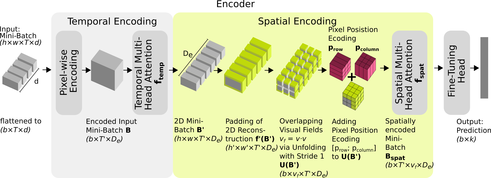
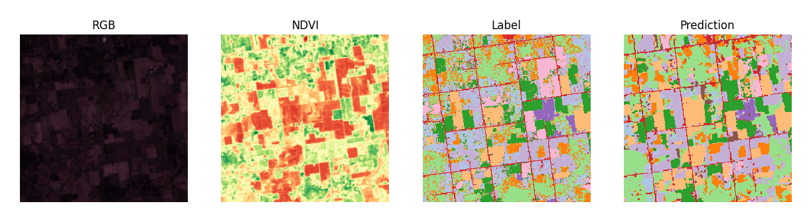

# VisTOS – Visual Fields for Lightweight Time Series Transformers in Earth Observation Semantic Segmentation
**Johannnes Keller**

*Attention-based VisTOS downstream-task architecture.*

## Setup:

## How to use pretraining and fine-tuning:

1.  In the project root create a new virtual environment:
    ```bash
    python3 -m venv .venv
    ```
2.  Activate virtual environment:
    ```bash
    source .venv/bin/activate
    ```
3.  Install requirements:
    ```bash
    python -m pip instll --upgrade pip
    pip install -r requirements.txt

### Pretraining:    

1.  Get the original pretraining dataset, following the instructions froms Tseng et al. (2024) from: https://github.com/nasaharvest/presto
2.  Define the `TRAIN_URL` and `VAL_URL` variables according to the Google Cloud bucket, where the data resides. Authenticate to Google Cloud.
3.  Define `environment`, `BATCH_SIZE`, `TRAIN_DATA_LENGTH`, and  `VAL_DATA_LENGTH` in params. 
4.  Start from the root directory:
    ```bash
    python main.py [model_type] pretrain [visual_field_size] 
    ```
    The parameter `model_type` can be `att` for the **attention-based spatial encoding model** or `conv` for the **convolution-based spatial encoding model**, the parameter `visual_field_size` must be defined and can be 1 (for Presto), 3 for a 3x3-pixel visual field, and 5 for a 5x5-pixel visual field in combination with the attention-based architecture (`att`) and 3, 5, and 7 for a 7x7-pixel visual field for the convolution-based architecture (`conv`).
5.  The model is cached automatically in the directory `output/cache`, where it is saved as a
    dictionary containing the training progress. After pretraining, the model is saved as .pth file in `output`. From there, it is loaded for fine-tuning.
    
### Fine-tuning:

#### PASTIS-R dataset:

*VisTOS visual field size 5 prediction on PASTIS-R dataset image (one time step).*

1.  Obtain the **PASTIS-R** dataset from: https://zenodo.org/records/5735646, change the constant
    `P_PATH` in `params` accordingly. 
2.  The pretrained model must reside in `output` as a .pth file following the pretraining naming conventions, with the same model type and the same visual field size you want to train. Otherwise a previously
    fine-tuned cached model is preferably loaded from `output/cache` if available. 
3.  Start the fine-tuning, after defining the corresponding parameters in `params`, with:
    ```bash
    python main.py [model_type] finetune pastis [visual_field_size]
    ```
    The parameter `model_type` can be `att` for the **attention-based spatial encoding model** or `conv` for the **convolution-based spatial encoding model**, the parameter `visual_field_size` must be defined and can be 1 (for Presto), 3 for a 3x3-pixel visual field, and 5 for a 5x5-pixel visual field in combination with the attention-based architecture (`att`) and 3, 5, and 7 for a 7x7-pixel visual field for the convolution-based architecture (`conv`).
4.  The model is cached automatically in the directory `output/cache`, where it is saved as a dictionary containing the training progress.

#### MTCC dataset:

*VisTOS visual field size 3 prediction on MTCC dataset image (one time step).*

1.  Obtain the **MTCC** dataset from: https://huggingface.co/datasets/ibm-nasa-geospatial/multi-temporal-crop-classification, change the constant `MTCC_PATH` in `params` accordingly. 
3.  The pretrained model must reside in `output` as a .pth file following the pretraining naming conventions, with the same model type and the same visual field size you want to train. Otherwise a previously        
    fine-tuned cached model is preferably loaded from `output/cache` if available. 
4.  Start the fine-tuning, after defining the corresponding parameters in `params`, with:
    ```bash
    python main.py [model_type] finetune mtcc [visual_field_size]
    ```
    The parameter `model_type` can be `att` for the **attention-based spatial encoding model** or `conv` for the **convolution-based spatial encoding model**, the parameter `visual_field_size` must be defined and can be 1 (for Presto), 3 for a 3x3-pixel visual field, and 5 for a 5x5-pixel visual field in combination with the attention-based architecture (`att`) and 3, 5, and 7 for a 7x7-pixel visual field for the convolution-based architecture (`conv`).
4.  The model is cached automatically in the directory `output/cache`, where it is saved as a dictionary containing the training progress.

## Credits: 

The code of the modules dataset, model, finetunig, utils, and pretraining is based on:

    "Presto: Lightweight, Pre-trained Transformers for Remote Sensing Timeseries",
    Gabriel Tseng, Ruben Cartuyvels, Ivan Zvonkov, Mirali Purohit, David Rolnick, Hannah Kerner (2024),
    arXiv: https://arxiv.org/abs/2304.14065,
    GitHub: https://github.com/nasaharvest/presto/

The code of the module pastis_r_dataset is based on:

    "Multi-Modal Temporal Attention Models for Crop Mapping from Satellite Time Series", 
    Vivien Sainte Fare Garnot, Loïc Landrieu, Nesrine Chehata (2021),
    arXiv: https://arxiv.org/abs/2112.07558,
    GitHub: https://github.com/VSainteuf/pastis-benchmark/blob/main/code/dataloader.py

The MTCC dataset originates from: 

    "LHLS Multi Temporal Crop Classification",
    Cecil, Michael and Kordi, Fatemehand Li, Hanxi (Steve) and Khallaghi, Sam and Alemohammad, Hamed (2023).
    Huggingface: https://huggingface.co/ibm-nasa-geospatial/multi-temporal-crop-classification
